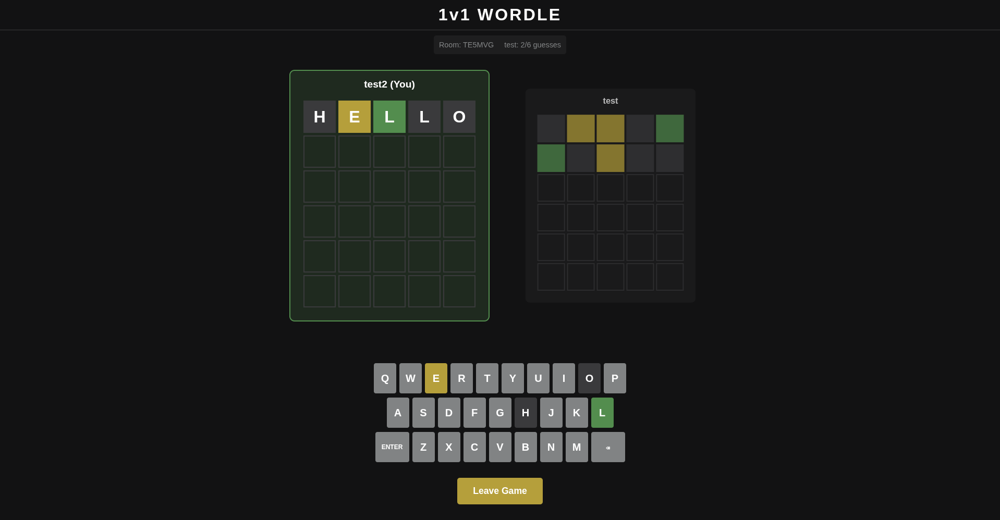

# 1v1 Wordle

Me and a friend wanted to play 1v1 wordle so I speedran making this with Opus




## Tech Stack

- **React 19** + **TypeScript** - Type-safe UI
- **Styled-Components** - Beautiful theming
- **Framer Motion** - Smooth animations & transitions
- **Firebase Realtime Database** - Live multiplayer sync
- **Vite** - Lightning-fast dev & build

## Features

- 🎮 **Create or Join** rooms with 6-character codes
- 👥 **Real-time multiplayer** - see opponent progress without spoilers
- 🎯 **Classic Wordle** - 6 guesses to solve the word
- 🏆 **First to win** - first correct guess takes the match
- ✨ **Smooth animations** - flip tiles, pop keys, spring transitions
- ⌨️ **Dual input** - physical keyboard + on-screen buttons

## Quick Start

### Setup

1. **Clone & install**
   ```bash
   npm install
   ```

2. **Firebase setup**
   - Create a Firebase Realtime Database project
   - Copy `.env.example` to `.env`
   - Add your Firebase credentials

3. **Run**
   ```bash
   npm run dev
   ```

### How to Play

1. Create a room (you're the host)
2. Share the 6-character code with your friend
3. Friend joins with the code
4. Click "Start Game"
5. Race to guess the word first!

## Rules

- Same word for both players
- 6 guesses to solve
- 🟩 Green = correct position
- 🟨 Yellow = right letter, wrong spot
- ⬛ Gray = not in word
- **First correct guess wins!**
